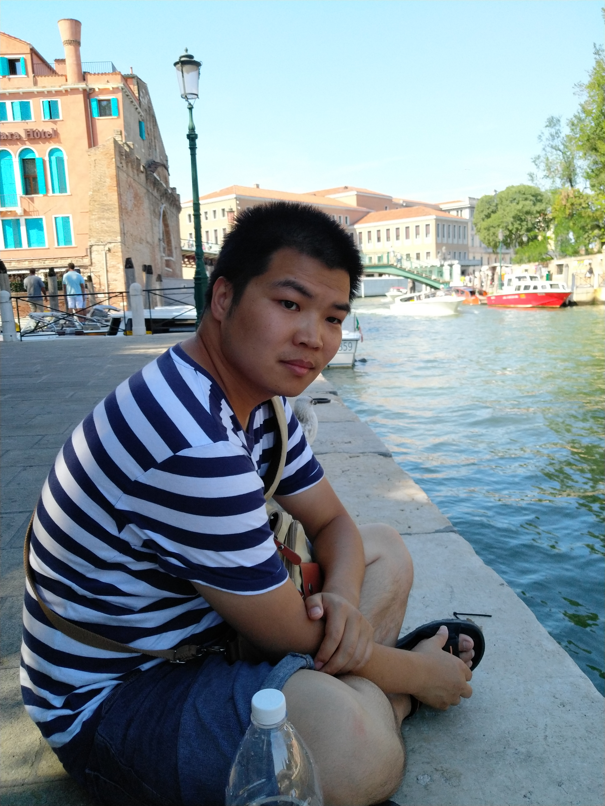

+++
title = 'About Me'
date = 2023-12-20T13:55:10+08:00
draft = false 
+++



My name is Shang Zhihao. I got my PhD from Free University of Berlin in Dec. 2019. I am working at Zhengzhou University of Light Industry now. My research interests include time series forecastng, deep learning.

 


### Education:

- Freie Universtät Berlin, Germany Ph.D. in Computer Science
- Lanzhou University, China MSc. in Computer Software and Theory
- Henan University of Chinese Medicine, China B.E. in Computer Science and Technology

### Work Experience:

- 2020.06 to 2023.06, post doctor at Zhengzhou Universtiy
- 2023.07 to now, Lecturer at Zhengzhou University of Light Industry

### Projects:
- 2021.09 to 2023.06, Time Series Analysis-Based Fault Prediction Technology for Carrier-Based Aircraft Engines from China Postdoctoral Science Foundation
- 2023.09 to now, Man-machine Coordination for Failure Prediction of Carrier-based
Aircraft Based on Time Series Forecasting from Natural Science Foundation of Henan Province

### Contact Information:
zhihao.shang(at)zzuli.edu.cn\
School of Computer Science and Technology,\
Zhengzhou University of Light Industry,\
Science Avenue 136, Zhengzhou,\
Henan Province, China

