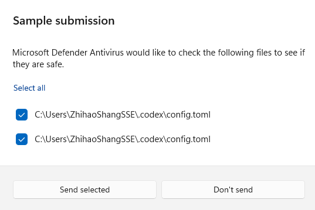

+++
title = 'threat from codex config'
date = 2026-06-23T15:00:00+02:00
draft = false
+++

Nice, Microsoft Defender asked to upload my Codex `config.toml` as a sample
submission. Microsoft taught me that my Codex config could be a potential
threat. Learnt a lot from this.

