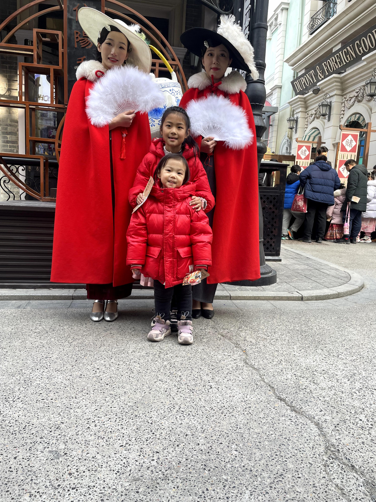

+++
title = "New Year's Day"
date = 2024-01-02T14:22:05+08:00
tags = ['travelling', 'family']
draft = false
+++

We went to Jianye Huayi Brothers Film Townlet on the New Year's day. My daughter and niece were expected together on my father's birthday two weeks ago. My nephew had a fever when my borther's family was on the way to my place. They had to go to the hospital. The two little girls were very sad and cried for a while. Finally, they saw each other on my birthday and went to the Film Townlet on the second day.

All cameras on me. I am a movie star.

A journey back to Shanghai streets in the 1920s.

We are in the space.

Acrobatics, my daughter was very excited about the acrobatics. She laughed and said "so funny" when watching the show. I am very happy she can speak English in her daily life.

A wharf, this is a place where one is apt to get into trouble.

Night fell. The street was more beatiful, but we had to go home.

 It was very cold and my son is too little to go outside. We left him at home. I did not see him for the whole day. He must miss mommy and daddy. Poor little baby, the god must be kidding with you. Hope you be well soon.

